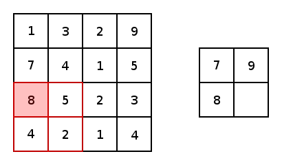

# Tensorflow_youtube

[Luyuan Shi](https://www.youtube.com/channel/UC2Sj-_Y1_F17BwwNJ0wg4EA)

### 第一课 Tensorflow的简介 

`tensorboard` 作为Tensorflow的调试器，非常强大，还可以显示3D图．

`jupyter notebook` 可以作为一个编辑器，用起来也是很流畅的．

> 但是我使用conda虚拟环境诶，这个需要额外配置．暂时放弃．

> 后面发现 `jupyter notebook`的自动补全功能很好用，舍不得放弃．下面是配置方法：
>
> 1. 进入coda环境：`source activate 环境名称 `
> 2. 安装`ipykernel`:`conda install ipykernel  `
> 3. 将环境写入notebook的kernel中: `python -m ipykernel install --user --name 环境名称 --display-name "Python (环境名称)" `
> 4. 打开`notebook`:`jupyter notebook  `
>
> [参考链接](https://blog.csdn.net/u011606714/article/details/77741324)
>
> Tip: 每次新建一个Notebook的时候要结束运行上一个Notebook, 不然会出现奇怪的错误．

GPU版本的`tensorflow`需要先安装 `CUDA` 

### 第二课 Tensorflow基础

Tensorflow这个编程系统的一个基本流程是，先搭建网络，再让`Tensor`流过网络，进而利用数据训练出模型．

`Graphs`: 表示计算任务．就是网络

`Session`: 控制程序运算的过程，在这个过程中让数据流过网络．

`tensor`:表示数据

`feed`: 表示把数据喂入神经网络．

`operation`:也叫网络的节点`node`是属于`Graphs`的．

下面是一张结构图：（我个人认为这张图不太好）

#### 创建图，执行图

### Fetch and Feed

`Fetch`就是用来运行多个`operation`

`Feed`就是计算的时候在喂数据

#### 简单线性回归的例子

`tf.reduce_mean()`:表示求平均值的意思

### 第三课 MNIST数据集

#### MNIST

[数据集官网](http://yann.lecun.com/exdb/mnist/)

**训练集**

60000行训练，10000行测试。28x28=784

MNIST训练数据集中`mnist.train.images`是一个形状为`[60000, 784]`的张量。

> 第一个维度索引第几张图，第二个维度索引像素值

`1`最黑，`0`最白

**标签**：

`one-hot vector`:出了某一位的数字为1外其余维度数字都是0, 比如`([0,0,0,1,0,0,0,0,0,0])` 表示标签`3`

因此，mnist.train.labels是一个`[60000,10]`的数字矩阵。

**Softmax函数**：

用来给不同的对象分配概率，因为输出层输出是数字，人看起来不直观，转换成概率就直观了。

`x_data = np.linspace(-0.5, 0.5, 200)[:,np.newaxis]`：把一维数据变成二维

`noise = np.random.normal(0, 0.02, x_data.shape)`：`0`均值，`0.02`是标准差

`//`：表示整除

问：==隐藏层的输出需要激活吗==？

### 第四课：优化神经网络

#### 代价函数

`quadratic cost`: 二次代价函数

上式对`w` 和 `b`求偏导可得：

`w`和`b`的梯度跟激活函数的梯度成正比，激活函数的梯度越大，`w`和`b`的大小调整得越快，训练收敛得就越快．

==所以激活函数只和速度有关系吗？==

二次代价函数调整的速度有时候会不合理。因此我们有**交叉熵代价函数** (Cross entropy)：

`w`和`b`的调整速度和误差成正比：==这就是我们期望的== 

#### 拟合

- 欠拟合
- 正确拟合
- 过拟合（训练数据集很好，用新的数据测试不好）

解决过拟合的方法：

- 增加数据集
- 正则化方法: 定义新的损失函数  $$C = C_0 + \frac{\lambda}{2n} \sum_w{w^2}$$ 通过 $\lambda$ 控制 $w$ ，让那些很小的$w$就让他们接近`0` 减少网络的复杂程度。
- **Dropout**：在每次训练的时候人为地让一些神经元不工作。使用Dropout后收敛的速度变慢了。

==w和b如果初始化为0很有可能会造成训练没有办法收敛。==

==损失函数总是有`tf.reduce_mean()`是为什么？==

#### 优化器: optimizer

梯度下降法：

- 标准梯度下降法：计算所有样本的误差，然后更新权值（下降方向准，但是时间长）
- 随机梯度下降法：计算一个样本的误差。马上更新权值（下降方向不太准，时间短）
- 批量梯度下降法：前两种的折中（下降方向挺准，时间还不算太长）

几个参数：

$W$: 要训练的参数

$J(W)$:代价函数

$\nabla_WJ(W)$: 代价函数的梯度 (梯度是一个向量，有大小有方向)

$\eta$: 学习率

**SGD**: 随机梯度下降法

**Momentum**:当前权值的改变会受到上一次权值改变的影响。类似于小球向下滚带上了惯性。加快收敛。

$\nu$: 动力系数，通常为0.9

**NAG(Nesterov accelerated gradient)**: NAG和Monentum合并在一个函数中，但这是一个更聪明的小球。它提前知道要滚到哪里，还知道要到坡低的时候速度慢下来，而不是冲上另一个破。

**Adagrad**: 基于sgd. 核心思想是对比较常见的数据给比较小的学习率去调整参数，对于比较罕见的数据给予比较大的学习率去调整参数。很适合下面这样的数据集(比如一个图片数据集，有10000张狗的照片，10000张猫的照片，但只有100张大象的照片)。 

优势: 不需要认为调整学习率，可以自动调节。缺点是：随着迭代的次数增多，学习率也会越来越低，最终趋向于0

**RMSprop**:

RMS(Root Mean Squre)是均方根的缩写

在Adagrad的基础上，可以自动调节学习率，但学习率也不会趋于0了。

**Adadelta**:

不用设置学习率

**Adam**: 

各种优化器的对比：

每一种优化器各有特点，有些慢但是准确，有些快但是不准确。我们要的不仅仅是训练速度快，还要模型比较精准。

调试的时候可以使用用比较快的优化器，做好之后，把所有的优化器试一遍，找出最好的。

优化：

修改中间层的的激活函数。

### 第五课 Tensorboard

上次的作业：

网络越复杂准确度越高吗？

keep_prob为多少比较合理呢？ 0.9 比较合适，如果太大，有点感觉降低了网络的复杂程度。

使用动态学习率是个比较不错的选择。

Tensorboard: 

1. 查看程序结构，数据流向

2. 查看程序运行时的数据

### L6 CNN

全连接网络的困难：
- 权值太多

- 神经元的个数非常多

- 计算量非常大

经验之谈: 数据量的大小是权值个数的5到30倍

**局部感受野**：1962 Hubel 和 Wiesel 猫

减少参数: 局部感受野，和权值共享

#### **卷积核**：对原图采样， 可以看作是一个滤波器。

卷积核的定义有很多种，该如何选择呢？ 不同的卷积核可以提取图片的不同的**特征**，形成不同的**特征图**。

**越多的特征图对于图片的分类就有更好的效果**。一个卷积核处理原始图片后就会得到一个**feature map**

卷积核其实是可以看作一个`cube` 

卷积的两种操作:

- same padding: 
- valid padding:

#### **池化**：

有**大小**，**步长**等特征

- max-pooling
- mean-pooling

池化也有两种padding的方式：和卷积的padding方式有少许不同
- same padding: **可能**会给平面外部补0
- valid padding: **不会**超出平面外部

CNN的结构：

